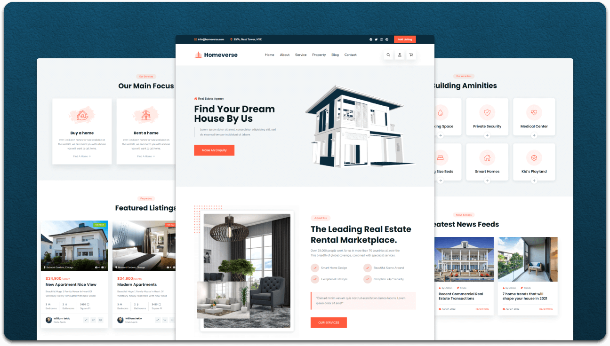
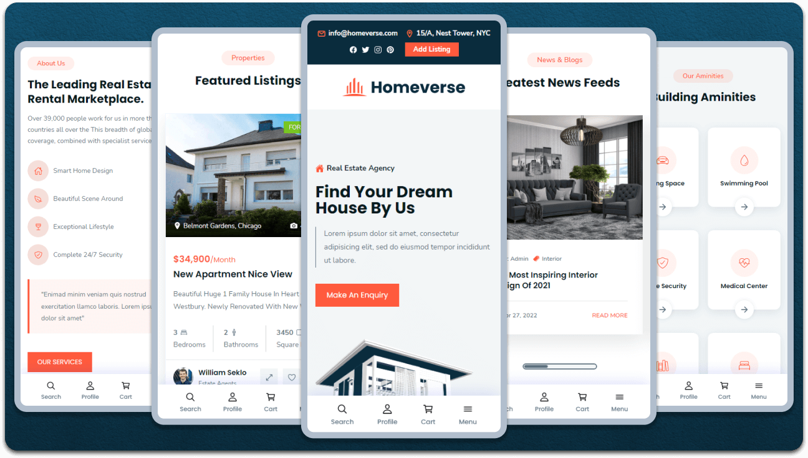

<div align="center">
  
  
  

  <br />
  <br />
  
  

  <h2 align="center">Skyview Properties Limited - Land to Flat Developer</h2>

  Skyview Properties Limited is a land development and residential real estate company based in Dhaka, Bangladesh.<br />We specialize in acquiring premium land and developing quality residential flats. Fully responsive website built with HTML, CSS, and JavaScript.

  <a href="http://localhost:8000"><strong>➥ View Website</strong></a>

</div>

<br />

### About Project

**Skyview Properties Limited** is a trusted land-to-flat developer in Dhaka, Bangladesh. Our business model focuses on:

- 🏗️ **Land Acquisition**: Identifying and acquiring prime land parcels in strategic Dhaka locations
- 🏢 **Flat Development**: Transforming raw land into modern residential apartments with contemporary amenities
- 💰 **Investment Opportunities**: Offering flexible shared investment options for multiple investors
- 📋 **Transparent Operations**: Ensuring legal compliance and transparent dealings with all stakeholders

### Project Developer

**Created by:** Md. Naimur Rahman  
**Education:** BSc CSE, BRAC University  
**Email:** md.naimur.rahman@g.bracu.ac.bd

### Features

✅ Fully Responsive Design - Works on all devices (Mobile, Tablet, Desktop)  
✅ Modern UI/UX - Clean and professional interface  
✅ Service Showcase - Land Acquisition, Flat Development, and Handover processes  
✅ Project Portfolio - Display of ongoing and completed residential projects  
✅ Investment Information - Details about land-to-flat development opportunities  
✅ Contact Information - Easy access to company details and location  

### Demo Screenshots




### Tech Stack

- **HTML5** - Structure
- **CSS3** - Styling & Responsive Design
- **JavaScript** - Interactivity
- **Ionicons** - Icon library
- **Google Fonts** - Typography

### Prerequisites

Before you begin, ensure you have met the following requirements:

* [Git](https://git-scm.com/downloads "Download Git") must be installed on your operating system
* A web browser to view the website

### Run Locally

To run **Skyview Properties** locally:

**Windows:**

```bash
git clone https://github.com/skyview-properties/skyview-properties.git
cd skyview-properties
python -m http.server 8000
```

Then open `http://localhost:8000` in your browser.

**Linux and macOS:**

```bash
git clone https://github.com/skyview-properties/skyview-properties.git
cd skyview-properties
python3 -m http.server 8000
```

### Project Structure

```
skyview-properties/
├── index.html           # Main webpage
├── assets/
│   ├── css/
│   │   └── style.css    # Main stylesheet
│   ├── js/
│   │   └── script.js    # JavaScript functionality
│   └── images/          # All project images
├── favicon.svg          # Website favicon
└── README.md            # Documentation
```

### Key Sections

1. **Hero Section** - Introduction to Skyview Properties
2. **About Us** - Company overview and values
3. **Our Services** - Land Acquisition, Flat Development, Handover Process
4. **Our Projects** - Showcase of flat development projects
5. **Amenities** - Building features and facilities
6. **Blog/Projects** - Latest updates and developments
7. **Call-to-Action** - Investment inquiry section
8. **Contact & Footer** - Company information and links

### Deployment

This website can be deployed to:
- **Netlify** - Drag and drop deployment
- **GitHub Pages** - Free hosting from GitHub
- **Vercel** - Auto-deployment from Git
- **Traditional Web Hosting** - Any standard web host

### Contact

- **Email:** md.naimur.rahman@g.bracu.ac.bd
- **Location:** 83/2 ECB Chottor, Pallabi, Dhaka, Bangladesh
- **Phone:** +880-1234-567890

### License

This project is created for Skyview Properties Limited and is proprietary.

---

**Skyview Properties Limited – Land to Homes, Dreams to Reality**

